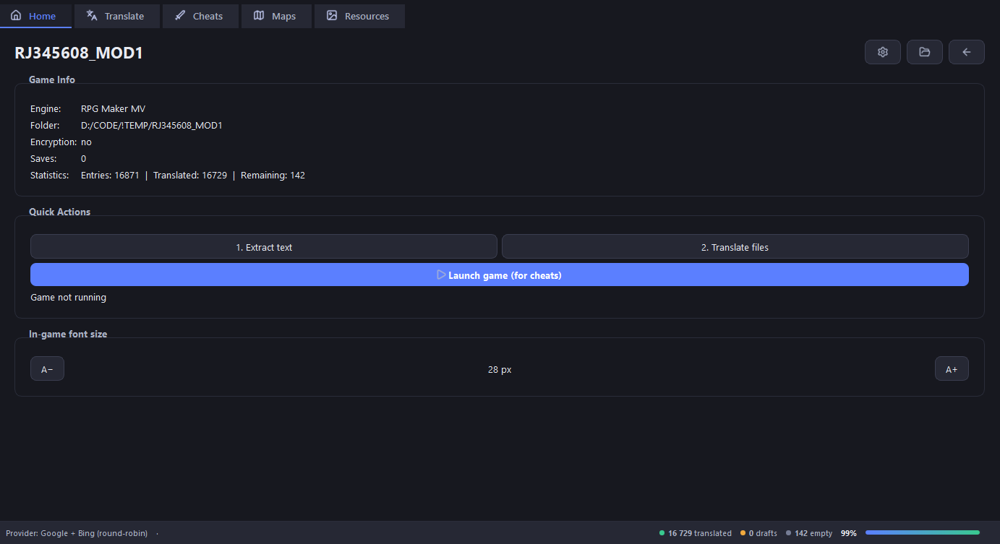
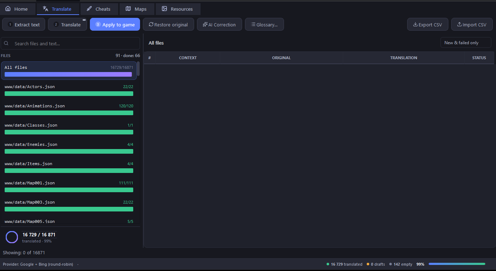
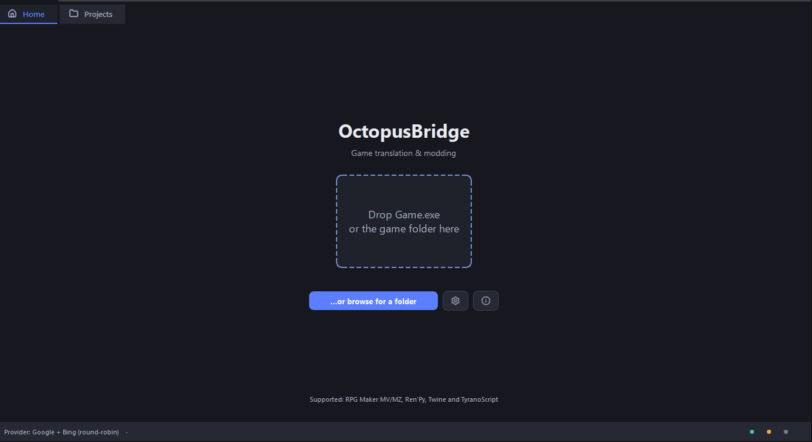
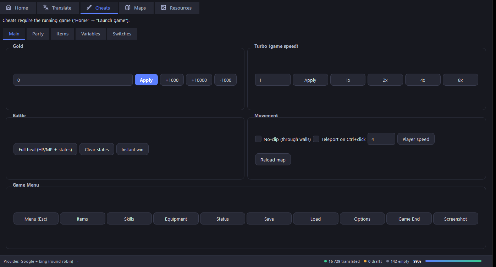
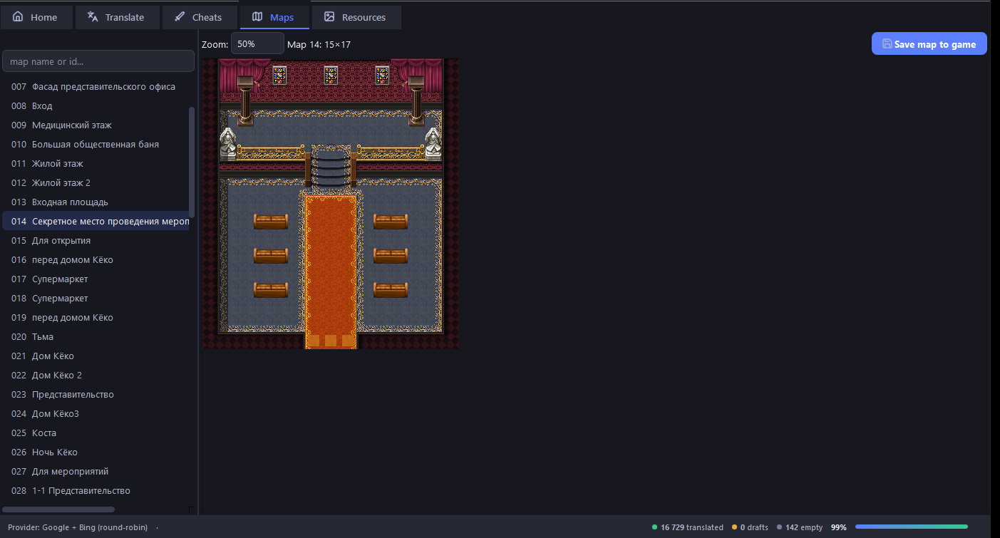
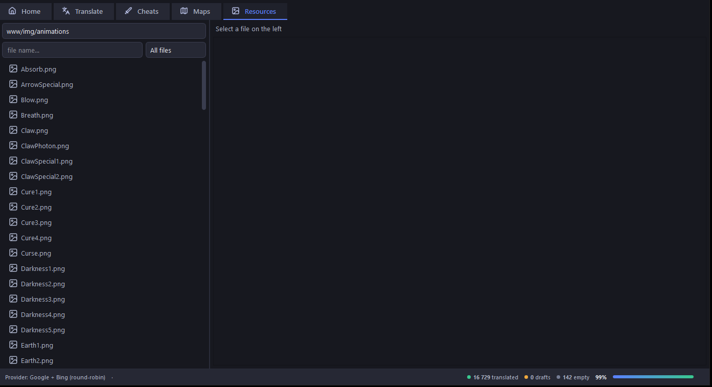

  

<h1 align="center">OctopusBridge</h1>

  <b>Инструмент перевода и модификации игр на Twine, Ren'Py, RPG Maker и Tyrano</b>

  
  
  
  
  

  <a href="https://github.com/DezFix/OctopusBridge/blob/main/README.md">English version</a>

<!-- 🖼️ Лучшее, что можно сделать — GIF или скриншот приложения: открыли проект → извлекли текст → перевели → применили, 5–10 секунд, по кругу.
      -->

> **⚠️ В разработке.** OctopusBridge активно дорабатывается. Возможны баги, падения и повреждённые переводы, особенно для движка **Twine**. Перед переводом всегда делайте резервную копию игры и сообщайте о найденных проблемах.

---

## Оглавление

- [Что это](#что-это)
- [Возможности](#возможности)
- [Скриншоты](#скриншоты)
- [Поддерживаемые движки](#поддерживаемые-движки)
- [Требования](#требования)
- [Установка](#установка)
- [Быстрый старт](#быстрый-старт)
- [Примечания](#примечания)
- [Лицензия](#лицензия)

---

## Что это

OctopusBridge переводит и модифицирует игры на ПК. Перевод **пакетный**: текст извлекается из файлов игры, переводится и записывается обратно до запуска игры — без ручного копирования и правки исходников игры.

---

## Возможности

|  |  |
|---|---|
| ⚡ **Быстрый пакетный перевод** | До 100 строк в пакете, несколько пакетов параллельно — ~28 600 строк/мин на бесплатных endpoints Google. |
| 🤖 **AI и бесплатные варианты** | Без ключей и регистрации (бесплатные endpoints Google/Bing). Для больших объёмов — любой OpenAI-совместимый API. |
| 🎮 **Читы и инструменты в игре** | Переменные, золото, телепорт, редактор карт, редактор сейвов, просмотр ресурсов, патч шрифта — в зависимости от движка. |
| 📚 **Глоссарий и память переводов** | Общая база SQLite для всех проектов, автоматическое маскирование игровых кодов (`\C[8]`, `
`, …). |
| 🧠 **AI-корректор** | Полирует переводы с учётом глоссария и контекста, показывает дифф для проверки перед применением. |
| 🌙 **Аккуратный интерфейс** | Тёмная тема, русский/английский, системный трей, drag-and-drop, встроенный чейнджлог. |

---

## Скриншоты

---

## Поддерживаемые движки

| Движок | Статус |
|---|---|
| RPG Maker MV / MZ | ✅ Стабильно (в т. ч. Electron-сборки с `app.asar`) |
| Ren'Py | ✅ Стабильно |
| TyranoScript / TyranoBuilder | ✅ Поддерживается |
| Twine (SugarCube) | 🧪 Экспериментально |

---

## Требования

- Windows 10/11 (64-бит)
- ~500 МБ свободного места на диске

---

## Установка

1. Скачайте `OctopusBridge.exe` со [страницы релизов](https://github.com/DezFix/OctopusBridge/releases) и запустите.

> EXE не подписан — Windows SmartScreen может показать предупреждение. Нажмите **«Подробнее» → «Выполнить в любом случае»**.

---

## Быстрый старт

1. **Откройте игру** — перетащите папку игры или `Game.exe` в окно приложения (или используйте вкладку «Проекты»).
2. **Переведите** — вкладка «Перевод файлов»: извлеките текст, нажмите **«Перевод»**, затем **«Применить»**, чтобы записать его обратно в игру.
3. **Читы / карты / сейвы** — доступны во вкладках движка после открытия проекта. Читы и карты работают с запущенной игрой, редактор сейвов — напрямую с файлами сохранений.

---

## Примечания

- Google/Bing — неофициальные бесплатные endpoints: ключи не нужны, но объём может быть ограничен. Для больших проектов подключите AI-провайдера в настройках.
- Инъекции изменяют процесс игры в памяти — используйте инструмент только на играх, которые вам принадлежат или которые вам разрешено модифицировать.
- Полный чейнджлог: [CHANGELOG.md](https://github.com/DezFix/OctopusBridge/blob/main/CHANGELOG.md)

---

## Лицензия

GPL-3.0 — см. [LICENSE](https://github.com/DezFix/OctopusBridge/blob/main/LICENSE). Проекты, которые вы создаёте в приложении, остаются вашими.

---

  ⭐ Если OctopusBridge вам помог — поставьте звёздочку репозиторию, это помогает другим его найти. 
  Нашли баг? <a href="https://github.com/DezFix/OctopusBridge/issues">Откройте issue</a> ·
  Хотите поддержать разработку? <a href="https://ko-fi.com/k_k">Кофе на Ko-fi</a>

